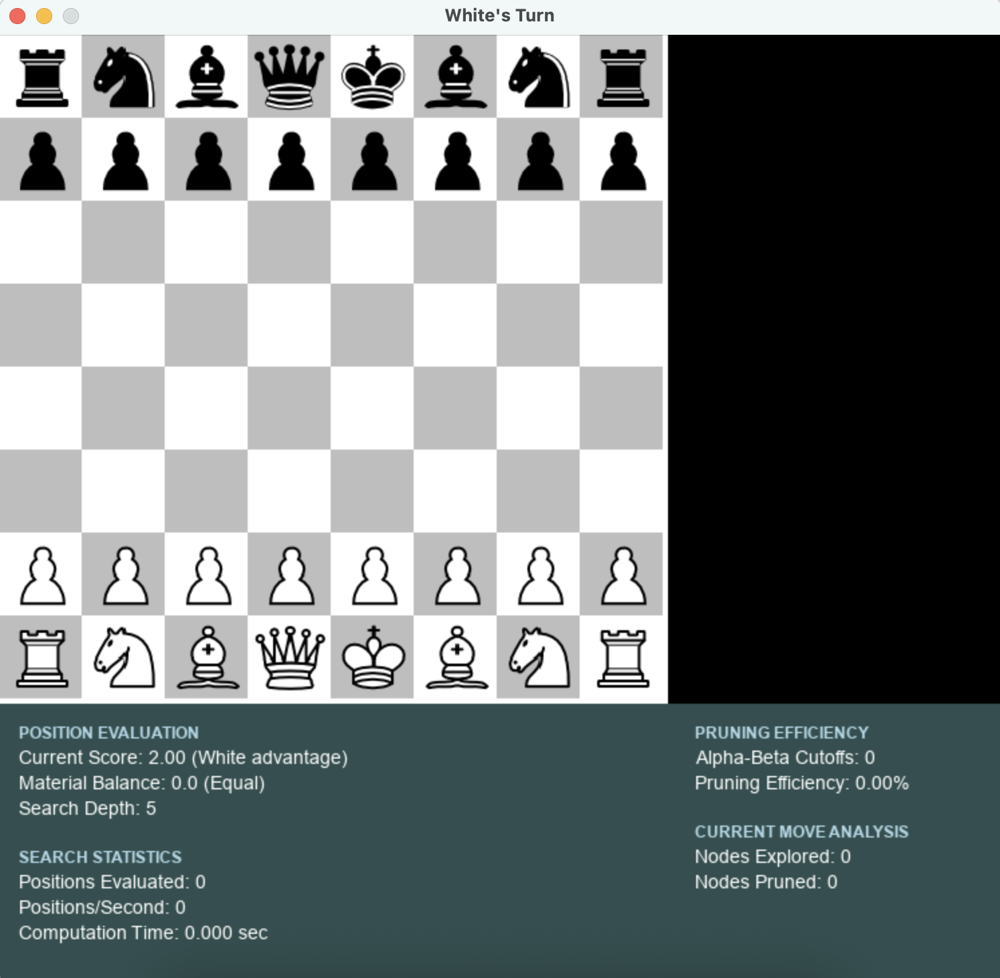

# Chess Engine Project

This project aims to develop a chess engine in Python, utilizing Pygame library, that incorporates various functionalities and intelligent algorithms to enhance move selection and provide an optimized playing experience.



## Project Features

- Engine development in Python using Pygame to implement key chess functionalities such as En Passant, Promotion, Castling, and all possible moves.
- Integration of a Greedy Algorithm to predict the optimal move, enhancing move selection.
- Implementation of the MinMax algorithm to analyze moves two stages ahead, improving the ChessAI's decision-making capability.
- Further refinement with the implementation of the NegaMax algorithm, a recursive version of MinMax, allowing customizable depth for move analysis.
- Advanced dynamic scoring system that evaluates piece mobility, attack patterns, and defense structures
- Parallelized evaluation using multiple CPU cores for faster computation
- Real-time statistics display showing position evaluation, search depth, and analysis metrics

## Recent Enhancements

- **Dynamic Position Evaluation**: The engine now uses a sophisticated system to dynamically score positions based on piece mobility, attacking potential, defensive structures, and control of important squares.
- **Parallel Processing**: Board evaluation is divided into regions processed simultaneously for faster computation.
- **Separate Thread Analysis**: Advanced position analysis runs in a separate thread to avoid slowing down move calculation.
- **Advanced Chess Concepts**: Added evaluation for pawn structure, king safety, and center control.
- **Improved UI**: Enhanced information panel displays detailed metrics on AI performance and position evaluation.

## Project Progression

1. The chess game was initially implemented, providing functionality to determine possible moves and setting conditions for valid moves, including features like king castling and pawn en passant.

2. With the completion of the chess game, two players can comfortably play with safety measures to prevent faulty moves.

3. The implementation of the ChessAI, which plays against human players, began with generating random moves.

4. The AI's move selection was then improved by incorporating the Greedy Algorithm, selecting moves from the validMoves list and considering their potential benefits by analyzing the subsequent move.

5. To enhance efficiency, the MinMax algorithm was employed to enable two-stage based move analysis, resulting in better move selection.

6. The algorithm was further refined by switching to the NegaMax implementation, offering flexibility in selecting the desired depth for move analysis.

7. While the NegaMax algorithm proved efficient, it became slower for depths of 2 and beyond. To address this, the concept of alpha-beta pruning was utilized, significantly improving the program's speed.

8. Various algorithms, including hashing techniques based on material sums and differences, were explored. However, the scoring approach, assigning specific scores to each piece and evaluating the board for each position, proved to be more efficient.

9. The latest improvement replaces static scoring with a dynamic evaluation system that continuously analyzes the position considering piece mobility, threats, and defensive structures, making the AI play more human-like chess.

# Installation and Setup

## Prerequisites

- Python 3.8 or higher
- Git (for cloning the repository)

## Setup Instructions

1. Clone the repository
```bash
git clone https://github.com/jayantp2003/Chess-Engine.git
cd Chess-Engine
```

2. Set up a virtual environment

On macOS/Linux:
```bash
python3 -m venv venv
source venv/bin/activate
```

On Windows:
```bash
python -m venv venv
venv\Scripts\activate
```

3. Install required dependencies
```bash
pip install -r requirements.txt
```

4. Run the game
```bash
cd chess
python ChessMain.py
```

To deactivate the virtual environment when you're done:
```bash
deactivate
```

## Gameplay Controls

- **Mouse**: Click on a piece and then click on a valid destination square to move
- **Z**: Undo the last move
- **R**: Reset the game to the starting position

## AI Information Panel

The panel at the bottom of the screen displays real-time information about the AI's analysis:

- **Position Evaluation**: Current score and material balance
- **Search Statistics**: Number of positions evaluated and computation speed
- **Pruning Efficiency**: How effectively the alpha-beta pruning reduces the search space
- **Current Move Analysis**: Detailed metrics on the current move being considered
